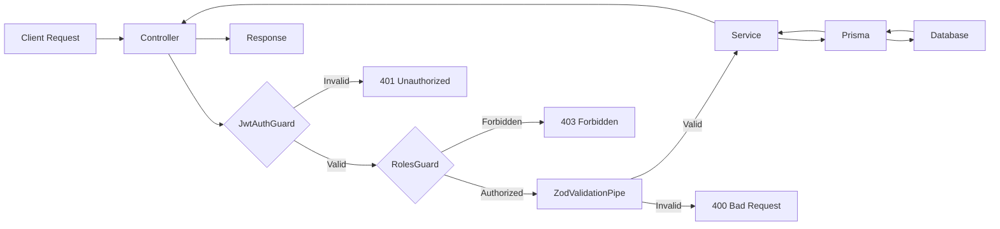

# Phân tích Kiến trúc NestJS - Hotel Management System

Tài liệu này phân tích chi tiết cách sử dụng NestJS trong hệ thống quản lý khách sạn, từ cấu trúc modules đến các design patterns được áp dụng.

---

## 1. Tổng quan về NestJS

NestJS là một framework Node.js progressive được xây dựng dựa trên TypeScript, sử dụng kiến trúc modular và dependency injection pattern.

### Các đặc điểm chính trong dự án
- **TypeScript-first**: Tận dụng type safety
- **Modular Architecture**: 11 feature modules độc lập
- **Dependency Injection**: Quản lý dependencies tự động
- **Decorator-based**: Sử dụng decorators để cấu hình metadata

---

## 2. Cài đặt NestJS và CLI Commands

### 2.1. Cài đặt NestJS CLI

```bash
# Cài đặt NestJS CLI globally
npm install -g @nestjs/cli

# Kiểm tra phiên bản
nest --version
```

### 2.2. Tạo dự án mới

```bash
# Tạo project mới
nest new project-name

# Với package manager cụ thể
nest new project-name --package-manager npm
nest new project-name --package-manager yarn
nest new project-name --package-manager pnpm
```

### 2.3. NestJS CLI - Các lệnh quan trọng

#### Generate Resources

```bash
# Tạo module
nest generate module users
# Hoặc viết tắt
nest g module users

# Tạo controller
nest g controller users

# Tạo service
nest g service users

# Tạo toàn bộ CRUD resource (module + controller + service + dto)
nest g resource users
# Lệnh này sẽ hỏi:
# - Transport layer (REST API / GraphQL / Microservice)
# - Generate CRUD entry points? (Yes/No)
```

#### Generate Guards, Pipes, Interceptors

```bash
# Tạo guard
nest g guard auth/guards/jwt-auth

# Tạo decorator
nest g decorator auth/decorators/roles

# Tạo pipe
nest g pipe common/pipes/validation

# Tạo interceptor
nest g interceptor common/interceptors/transform

# Tạo middleware
nest g middleware common/middleware/logger
```

#### Generate DTOs và Entities

```bash
# Tạo class (thường dùng cho DTO)
nest g class users/dto/create-user.dto --no-spec

# Tạo interface
nest g interface users/interfaces/user.interface --no-spec
```

### 2.4. Development Commands

```bash
# Chạy development server với hot-reload
npm run start:dev

# Chạy production mode
npm run start:prod

# Build project
npm run build

# Chạy tests
npm run test
npm run test:watch
npm run test:cov

# Linting
npm run lint
```

### 2.5. Cấu trúc thư mục được tạo tự động

Khi chạy `nest g resource users`, NestJS sẽ tạo:

```
src/
└── users/
    ├── users.module.ts
    ├── users.controller.ts
    ├── users.controller.spec.ts
    ├── users.service.ts
    ├── users.service.spec.ts
    ├── dto/
    │   ├── create-user.dto.ts
    │   └── update-user.dto.ts
    └── entities/
        └── user.entity.ts
```

### 2.6. Thêm Dependencies phổ biến

```bash
# Prisma ORM
npm install @prisma/client
npm install -D prisma
npx prisma init

# JWT Authentication
npm install @nestjs/jwt @nestjs/passport passport passport-jwt
npm install -D @types/passport-jwt

# Validation với Zod
npm install nestjs-zod zod

# Config
npm install @nestjs/config

# Logging
npm install nestjs-pino pino-http pino-pretty

# Redis & Bull Queue
npm install @nestjs/bull bull ioredis
npm install -D @types/ioredis

# Stripe
npm install stripe

# File Upload (Cloudinary)
npm install cloudinary

# Security
npm install helmet
```

### 2.7. Tips khi dùng NestJS CLI

```bash
# Xem tất cả các lệnh có sẵn
nest --help

# Xem chi tiết về một lệnh
nest generate --help

# Tạo resource trong subfolder
nest g resource modules/booking

# Bỏ qua tạo test files
nest g service users --no-spec

# Dry run (xem trước những file sẽ được tạo)
nest g module users --dry-run
```

---

## 3. Cấu trúc Project

### File Entry Point: `main.ts`

```typescript
// backend/src/main.ts
async function bootstrap() {
  const app = await NestFactory.create<NestExpressApplication>(AppModule);
  
  // Logger (Pino)
  app.useLogger(app.get(Logger));
  
  // Security (Helmet)
  app.use(helmet({ ... }));
  
  // CORS
  app.enableCors({
    origin: 'http://localhost:3000',
    credentials: true,
  });
  
  await app.listen(3001);
}
```

**Chức năng:**
- Khởi tạo ứng dụng NestJS
- Cấu hình security với Helmet
- Enable CORS cho Next.js frontend
- Tích hợp Pino logger

---

## 3. Module Architecture

### 3.1. Root Module: `AppModule`

```typescript
@Module({
  imports: [
    ConfigModule.forRoot({ isGlobal: true }),
    BullModule.forRootAsync({ ... }),
    LoggerModule.forRoot({ ... }),
    
    // Feature Modules
    AuthModule,
    UsersModule,
    BookingsModule,
    RoomsModule,
    PaymentsModule,
    ReviewsModule,
    ServicesModule,
    ServiceBookingsModule,
    StripeModule,
    NotificationsModule,
    RolesModule,
    
    // Infrastructure Modules
    PrismaModule,
    RedisModule,
    UploadModule,
  ],
  controllers: [AppController],
  providers: [AppService, JwtService, RedisService],
})
export class AppModule {}
```

**Phân loại Modules:**
1. **Global Modules**: ConfigModule, LoggerModule
2. **Feature Modules**: 11 modules xử lý business logic
3. **Infrastructure Modules**: PrismaModule, RedisModule, UploadModule

---

### 3.2. Feature Module Pattern

Mỗi feature module tuân theo cấu trúc chuẩn:

```
auth/
├── auth.module.ts         # Module definition
├── auth.controller.ts     # HTTP routes
├── auth.service.ts        # Business logic
├── dto/                   # Data Transfer Objects
│   └── auth.dto.ts
├── guards/                # Authorization guards
│   ├── jwt-auth.guard.ts
│   └── roles.guard.ts
├── strategies/            # Passport strategies
│   └── jwt.strategy.ts
└── decorators/            # Custom decorators
    ├── public.decorator.ts
    └── roles.decorator.ts
```

**Ví dụ: AuthModule**

```typescript
@Module({
  imports: [
    UsersModule,
    PassportModule,
    JwtModule.register({
      secret: process.env.JWT_SECRET,
      signOptions: { expiresIn: '7d' },
    }),
  ],
  providers: [AuthService, JwtStrategy, LocalStrategy],
  controllers: [AuthController],
  exports: [AuthService],
})
export class AuthModule {}
```

---

## 4. Controllers: HTTP Request Handlers

Controllers xử lý HTTP requests và định nghĩa routes.

### 4.1. Ví dụ: BookingsController

```typescript
@Controller('bookings')
@UseGuards(JwtAuthGuard)
export class BookingsController {
  constructor(private readonly bookingsService: BookingsService) {}

  // POST /bookings
  @Post()
  @UsePipes(ZodValidationPipe)
  create(@Body() createBookingDto: CreateBookingDto) {
    return this.bookingsService.create(createBookingDto);
  }

  // GET /bookings
  @Get()
  @Roles('ADMIN', 'RECEPTIONIST')
  @UseGuards(RolesGuard)
  findAll(@Query() query: QueryBookingsDto) {
    return this.bookingsService.findAll(query);
  }

  // GET /bookings/:id
  @Get(':id')
  findOne(@Param('id') id: string) {
    return this.bookingsService.findOne(id);
  }
}
```

**Decorators sử dụng:**
- `@Controller()`: Định nghĩa base route
- `@Get()`, `@Post()`, `@Patch()`: HTTP methods
- `@UseGuards()`: Áp dụng guards
- `@Roles()`: Custom decorator cho role-based access
- `@Body()`, `@Param()`, `@Query()`: Extract data từ request

---

## 5. Services: Business Logic Layer

Services chứa toàn bộ business logic và tương tác với database.

### 5.1. Dependency Injection

```typescript
@Injectable()
export class BookingsService {
  constructor(private prisma: PrismaService) {}
  
  async create(dto: CreateBookingDto) {
    // Validate availability
    const isAvailable = await this.checkAvailability(dto);
    
    // Calculate pricing
    const pricing = await this.calculatePrice(dto);
    
    // Create booking
    return this.prisma.booking.create({ ... });
  }
}
```

**Lợi ích:**
- Tách biệt business logic khỏi HTTP layer
- Dễ test với dependency mocking
- Tái sử dụng logic giữa các modules

---

## 6. Authentication & Authorization

### 6.1. JWT Authentication

**Flow:**
1. User login → AuthService validates credentials
2. Generate JWT token với payload: `{ sub, email, roleId }`
3. Client gửi token trong `Authorization: Bearer <token>`
4. JwtAuthGuard verify token và attach user vào request

**JWT Strategy:**

```typescript
@Injectable()
export class JwtStrategy extends PassportStrategy(Strategy) {
  constructor(private prisma: PrismaService) {
    super({
      jwtFromRequest: ExtractJwt.fromAuthHeaderAsBearerToken(),
      secretOrKey: process.env.JWT_SECRET,
    });
  }

  async validate(payload: any) {
    const user = await this.prisma.user.findUnique({
      where: { id: payload.sub },
      include: { role: true },
    });
    return user;
  }
}
```

---

### 6.2. Role-Based Access Control (RBAC)

**RolesGuard:**

```typescript
@Injectable()
export class RolesGuard implements CanActivate {
  constructor(
    private reflector: Reflector,
    private prisma: PrismaService,
  ) {}

  async canActivate(context: ExecutionContext): Promise<boolean> {
    const requiredRoles = this.reflector.get<string[]>('roles', context.getHandler());
    
    const { user } = context.switchToHttp().getRequest();
    const userWithRole = await this.prisma.user.findUnique({
      where: { id: user.id },
      include: { role: true },
    });

    return requiredRoles.some(role => userWithRole.role.name === role);
  }
}
```

**Sử dụng:**

```typescript
@Get('admin-only')
@Roles('ADMIN', 'MANAGER')
@UseGuards(JwtAuthGuard, RolesGuard)
adminEndpoint() {
  return 'Admin data';
}
```

---

### 6.3. Public Routes

```typescript
// Decorator
export const Public = () => SetMetadata('isPublic', true);

// Sử dụng
@Post('login')
@Public()
login(@Body() loginDto: LoginDto) {
  return this.authService.login(loginDto);
}
```

**JwtAuthGuard** kiểm tra metadata `isPublic` và bỏ qua authentication cho route đó.

---

## 7. Data Validation với Zod

### 7.1. DTO Pattern

```typescript
import { createZodDto } from 'nestjs-zod';
import { z } from 'nestjs-zod/z';

// Zod Schema
export const CreateBookingSchema = z.object({
  userId: z.string().uuid(),
  checkInDate: z.string().datetime(),
  checkOutDate: z.string().datetime(),
  roomIds: z.array(z.string().uuid()).min(1),
  guestName: z.string().min(1),
  guestEmail: z.string().email(),
  guestPhone: z.string().regex(/^[0-9]{10}$/),
});

// DTO Class
export class CreateBookingDto extends createZodDto(CreateBookingSchema) {}
```

### 7.2. Validation Pipe

```typescript
@Post()
@UsePipes(ZodValidationPipe)
create(@Body() dto: CreateBookingDto) {
  // dto đã được validate tự động
  return this.bookingsService.create(dto);
}
```

---

## 8. External Integrations

### 8.1. Bull Queue (Background Jobs)

```typescript
// Module setup
BullModule.forRootAsync({
  imports: [ConfigModule],
  useFactory: async (configService: ConfigService) => ({
    redis: {
      host: configService.get('REDIS_HOST'),
      port: configService.get('REDIS_PORT'),
    },
  }),
  inject: [ConfigService],
}),
```

**Sử dụng:**
- Email notifications
- Webhook processing
- Scheduled tasks

---

### 8.2. Stripe Integration

```typescript
@Injectable()
export class StripeService {
  private stripe: Stripe;

  constructor(private configService: ConfigService) {
    this.stripe = new Stripe(this.configService.get('STRIPE_SECRET_KEY'));
  }

  async createCheckoutSession(dto: CreateCheckoutSessionDto) {
    return this.stripe.checkout.sessions.create({
      payment_method_types: ['card'],
      line_items: [...],
      mode: 'payment',
      success_url: '...',
      cancel_url: '...',
    });
  }
}
```

---

### 8.3. Cloudinary (File Upload)

```typescript
@Injectable()
export class UploadService {
  async uploadImage(file: Express.Multer.File) {
    return cloudinary.uploader.upload(file.path, {
      folder: 'hotel-management',
      transformation: [{ width: 1200, quality: 'auto' }],
    });
  }
}
```

---

## 9. Logging với Pino

### 9.1. Cấu hình

```typescript
LoggerModule.forRoot({
  pinoHttp: {
    transport: {
      targets: [
        // Terminal output với pretty format
        {
          target: 'pino-pretty',
          level: 'debug',
          options: { colorize: true },
        },
        // File logs
        {
          target: 'pino/file',
          level: 'info',
          options: { destination: './logs/app.log' },
        },
        {
          target: 'pino/file',
          level: 'error',
          options: { destination: './logs/error.log' },
        },
      ],
    },
  },
}),
```

**Kết quả:**
- Logs được ghi vào console (development)
- Logs được lưu vào files (production)
- Tách riêng error logs để dễ debug

---

## 10. Best Practices Được Áp Dụng

### 10.1. Module Organization
✅ Mỗi feature có module riêng  
✅ Shared modules (Prisma, Redis) được export  
✅ ConfigModule global để tránh import nhiều lần

### 10.2. Service Layer
✅ Business logic tách biệt khỏi controllers  
✅ Services chỉ phụ thuộc vào interfaces, không phụ thuộc vào implementation  
✅ Error handling tập trung với NestJS exceptions

### 10.3. Security
✅ JWT authentication cho protected routes  
✅ Role-based authorization với Guards  
✅ Helmet middleware cho security headers  
✅ CORS được cấu hình chặt chẽ

### 10.4. Data Validation
✅ Zod schemas cho type-safe validation  
✅ DTOs cho mọi endpoint  
✅ Validation errors được format đồng nhất

### 10.5. Error Handling
✅ Sử dụng NestJS built-in exceptions:
- `NotFoundException`
- `UnauthorizedException`
- `ConflictException`
- `BadRequestException`

---

## 11. Workflow Hoàn Chỉnh: Từ Request đến Response



**Các bước:**
1. Request đến Controller
2. JwtAuthGuard kiểm tra token
3. RolesGuard kiểm tra roles
4. ZodValidationPipe validate DTO
5. Service xử lý business logic
6. Prisma tương tác với Database
7. Response trả về Client

---

## 12. Tổng kết

Dự án sử dụng NestJS một cách chuyên nghiệp với:
- **11 Feature Modules** độc lập, dễ maintain
- **RBAC** đầy đủ với Guards và Decorators
- **Type-safe** validation với Zod
- **External integrations** (Stripe, Cloudinary, Redis)
- **Logging** và **Security** được cấu hình chuẩn

Kiến trúc này đảm bảo:
- ✅ **Scalability**: Dễ thêm features mới
- ✅ **Maintainability**: Code rõ ràng, dễ đọc
- ✅ **Testability**: Services có thể test riêng
- ✅ **Security**: Authentication & Authorization mạnh mẽ

---

*Tài liệu này được tạo để hỗ trợ quá trình học tập và nghiên cứu NestJS framework.*
